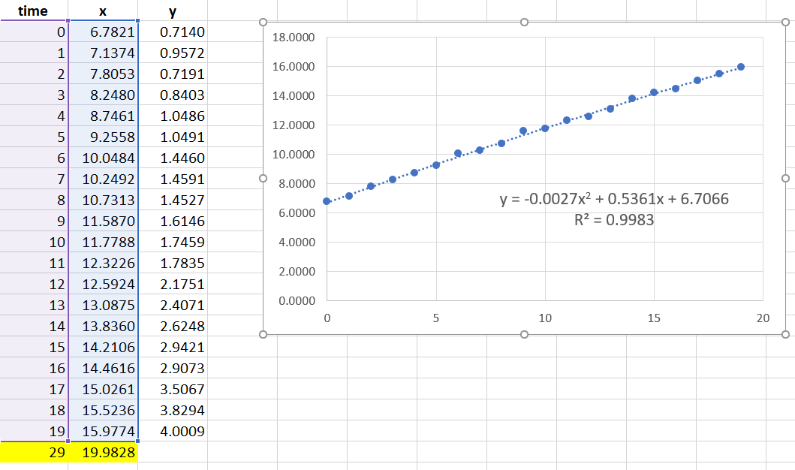
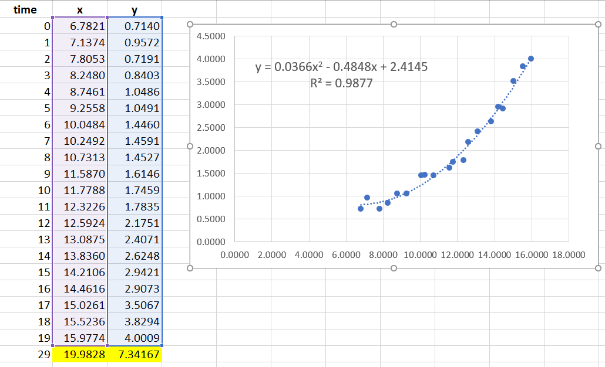
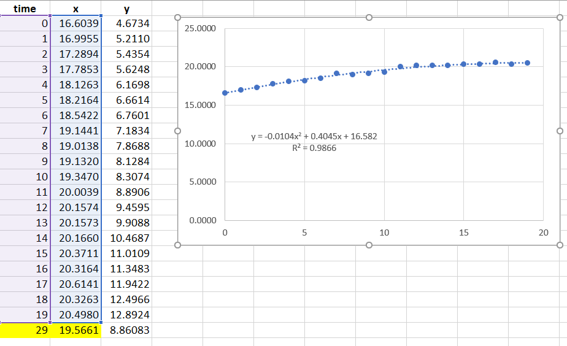
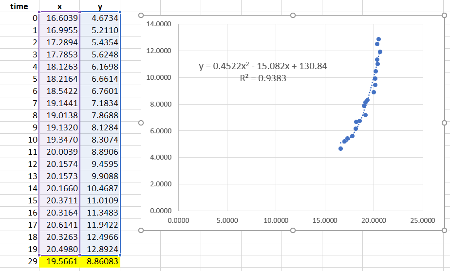
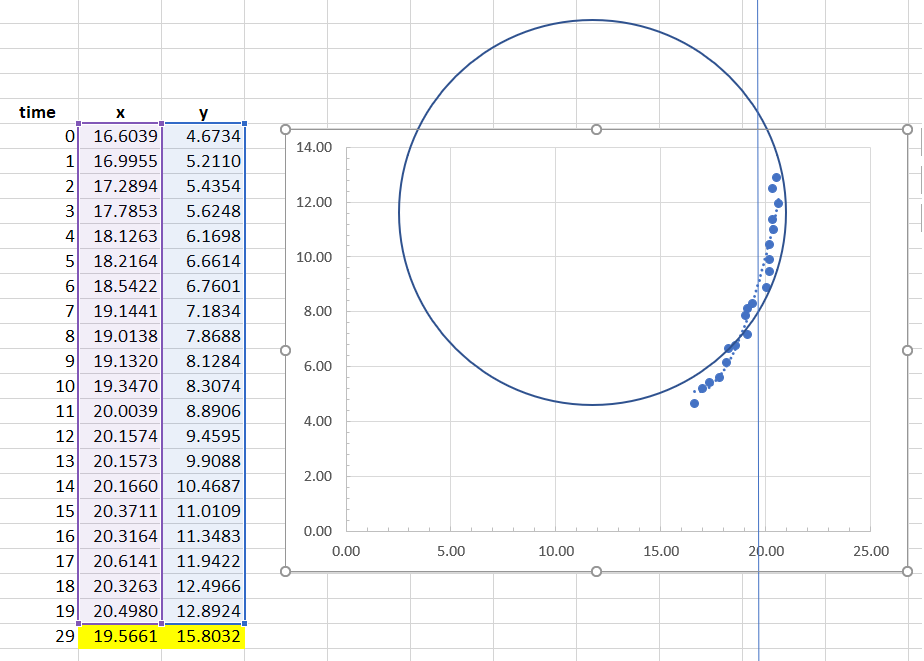

# Description

This is the Trajectory Prediction Python code for use with PyWren.

# Code

- function ```main()```:

  - is the entry point for testing the code
  - obviously not needed for PyWren
  - expects an input file path with the (x, y) coordinates and timestamp
  - the expected format:
  ```
  ... loc_x <float> loc_y <float> t <int> ...
  ```
  - for example:
  ```
  ... loc_x 1.650626 float loc_y 0.6246904 float t 1477010443200000 ...
  ... loc_x 2.188824 float loc_y 0.6487392 float t 1477010443300000 ...
  ... loc_x 2.655256 float loc_y 0.6659798 float t 1477010443400000 ...
  ```
  - example input file: 
  [input file example](https://bscclass01.bsc.es/gitlab/class/pcep/blob/collision_detection/pcep-sim/data/just_L.txt)

- class ```Vehicle```:

  Represents a vehicle object with its history.
  Its constructor takes 3 deques representing the last QUAD_REG_LEN x coordinates, y coordinates, and timestamps.
  This data needs to be filled in by DataClay. 

- function ```traj_pred()```:
  
  First calls quad_reg() on the timestamps and vct_x (the last QUAD_REG_LEN x coordinates) to find x' after QUAD_REG_OFFSET timestamps. For QUAD_REG_LEN = 20 and QUAD_REG_OFFSET = 10 it works like this:

  We have the last 20 measurements for this vehicle, of the (x, y) coordinates as given by the sensors and the timestamps. We construct a quadratic equation using the least squares method: https://www.varsitytutors.com/hotmath/hotmath_help/topics/quadratic-regression. This gives us an equation of the form y = ax^2 + bx + c, which best fits the historical data. From this equation, we get the projected position of x' after 10 more timestamps (by finding y for x = 29 (20+10-1)).

  Note that R squared (R^2) is also calculated. This number gives an indication as to how good the polynomial is, given the input data. As stated [here](https://en.wikipedia.org/wiki/Coefficient_of_determination): "R2 is a statistic that will give some information about the goodness of fit of a model.". A reasonable value for R2 for our purposes can be 0.8 for example. If after any of the quadratic regressions, the value of R2 is less than 0.8, then the data we used to determine the polynomial for some reason or other, is "abnormal" and the resulting quadratic equation shouldn't be used to project the future point of y'. Instead, it would be best ignored. To evaluate this though, it would be best to play with real data. 


  ## Example 1

  Given the following time and x vectors, the equation is y = -0.0027x^2 + 0.5361x + 6.7066, from which we calculate x' = 19.9828.

  

  We now have the projected x' and need to calculate the projected y'. In most cases this can be calculated with a 2nd quadratic regression on the actual data as in this example:

  

  From the equation y = 0.0366x^2 - 0.4848x + 2.4145 we calculate y' by pluggin in the x' value found previously, which gives us y' = 7.34167.

  So, the predicted position of the vehicle in 10 time stamps, currently at position (15.9774, 4.0009) and with the history depicted in the images is (19.9828, 7.34167).

  ## Example 2

  Given the times and xs in the image, the equation is y = -0.0104x^2 + 0.4045x + 16.582, from which we calculate x' = 19.5661.

  

  We now have the projected x' and need to calculate the projected y'. As stated in example 1, in most cases this can be calculated with a 2nd quadratic regression. In this case, the polynomial is given by y = 0.4522x^2 - 15.082x + 130.84, and by plugging in x' = 19.5661 we get y' = 8.86083. 

  

  This y' cannot be used as a future value of y, because it is in the range of data values used to determine the polynomial. There are possibly many ways to work around this situation. One would be to transpose the data values to a modified coordinate system (and then transpose (x', y') back) and another is to use a segment of a circle or ellipse instead of a quadratic equation to calculate the future value of y'.

  

  We use the solution presented here: https://dtcenter.org/met/users/docs/write_ups/circle_fit.pdf to find the equation of the circle. If the need arises when playing with real data, we can implement the ellipse fit algorithm.

  This solution results in a circle with centre at (x_c, y_c) = (11.8020, 12.0667), and radius R = 8.6163. This has been drawn roughly by hand here:

  

  And gives the two solutions for y to be: y1 = 15.0832, y2 = 8.3302. y2 is within the range, so the projected value y' = 15.0832.

  Note that x' is also within the range of x values, so this alone can be used to determine whether a circle/ellipse fit will be needed or if a 2nd quadratic regression will suffice. 

- function ```quad_reg()```:

  Direct implementation of this: https://www.varsitytutors.com/hotmath/hotmath_help/topics/quadratic-regression

- function ```circle_fit()```:

  Direct implementation of this: https://dtcenter.org/met/users/docs/write_ups/circle_fit.pdf, (particularly Eq. 4, Eq. 5, and Eq. 6). 

## License

Apache 2.0

By downloading this software, the downloader agrees with the specified terms and conditions of the License Agreement and the particularities of the license provided.
